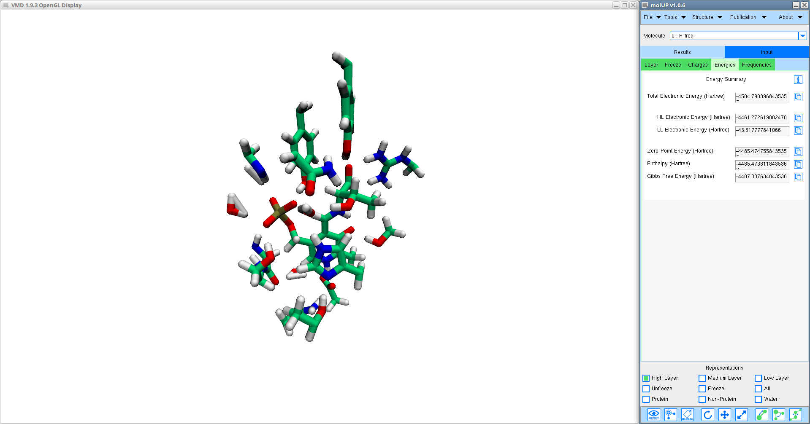
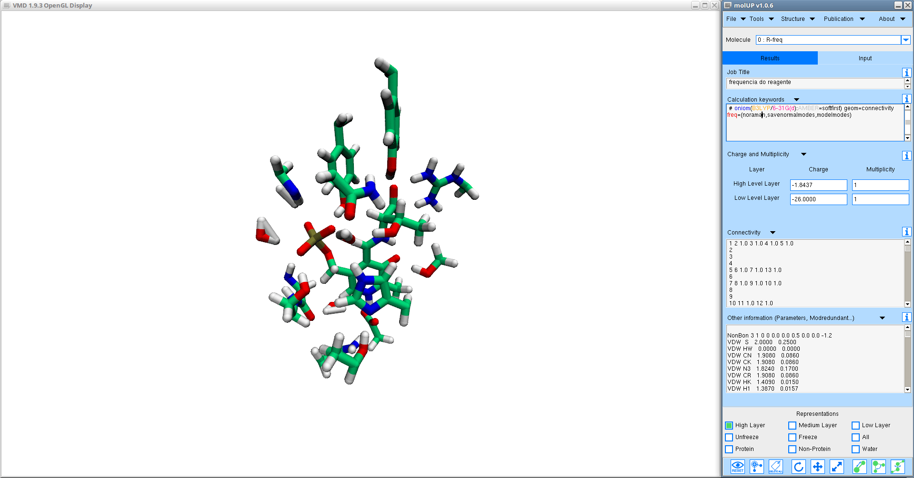
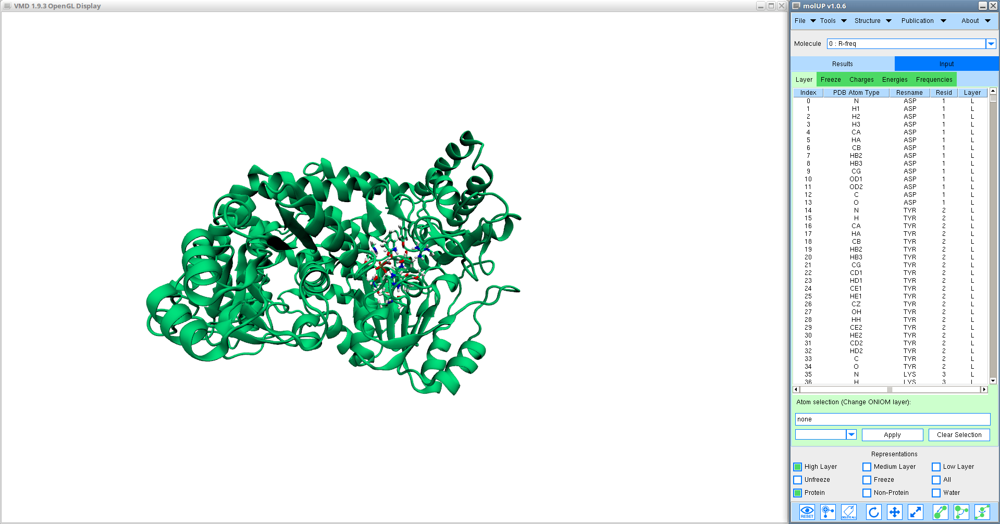
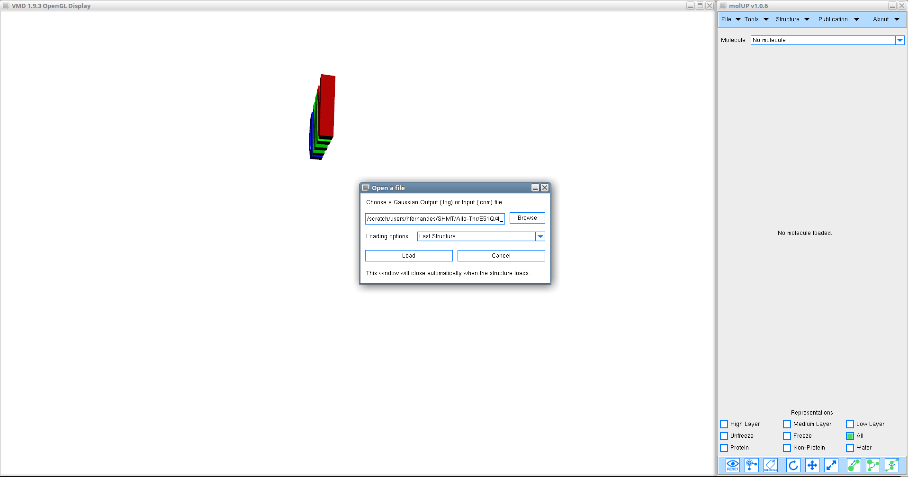

# Introduction

molUP is a VMD extension that provides a simple manner for loading and saving Gaussian files, and analyze related results. molUP provides a graphical interface for VMD where the users can load and save chemical structures in the Gaussian file formats. This extension includes a set of tools to set up any calculation supported by Gaussian, including ONIOM; analyze energies through interactive plots; animate vibrational frequencies; draw the vectors associated with those frequencies; modify bonds, angles, and dihedrals; and collect bibliographic information on the employed methods.

Main Features:
- Load Gaussian Input (.com) and Output files (.log) on VMD;
- Assign ONIOM layers (High-, Medium-, and Low-level);
- Select free and fixed atoms during geometry optimization (Freeze status);
- Analyze and edit atomic charges;
- Setup new Gaussian calculation using the Gaussian input section;
- Load scan across reactional coordinates and plot the structure's energies;
- Load Gaussian frequency calculations, animate the vibrational modes and show respective vectors;
- Show quick useful representations such as the protein, the different ONIOM layers, and the fixed atoms;
- Structural Manipulation: adjust the bond length, angle amplitude, and dihedral angle torsion;
- Provide a complete bibliographic list of references according to the type of methods and functionals that were employed in the calculation;
- Among others.

## Minimum Requirements

Operating System: macOS, Linux, and Windows

Visual Molecular Dynamics (VMD) 1.9.3 or later

## Installation

You could easily install molUP through [vmdStore](https://github.com/portobiocomp/vmdStore).

### Manual Installation
Alternatively, you could install molUP manually:
1. Download or Clone the repository.
2. Copy the molUP directory to a location on you computer. (Get that location!)
3. Copy the text inside "install.txt" file and paste on your .vmdrc file (macOS and Linux ) or vmd.rc file (Windows).
4. Replace the string "$::vmdStorePath/plugins/molUP" by your installation location (Step 2).
5. Save the .vmdrc or vmd.rc file.
6. Restart VMD.

### Run molUP from bash
molUP supports now the loading of Gaussian files directly from your command line (available for macOS and Linux).
Tutorial:
1. Add the following line to your .bashrc (Linux) or .bash_profile (macOS) file. (This file is located in the HOME directory) You have to edit the "path of the bashScript.tcl file" field by the complete path of this file that is located in the molUP installation directory: "molUP/lib/bashScript.tcl"
alias molUP='vmd -e "path of the bashScript.tcl file" -args'
2. Call molUP from the command line:
molUP "Gaussian file"

## Contacts
If you have any suggestion of new features, please contact us: henrique.fernandes@fc.up.pt

## Citation
S. Fernandes, H., M.J. Ramos, and N. M. F. S. A. Cerqueira, molUP: A VMD plugin to handle QM and ONIOM calculations using the gaussian software. Journal of Computational Chemistry

## DOI
http://doi.org/10.1002/jcc.25189
